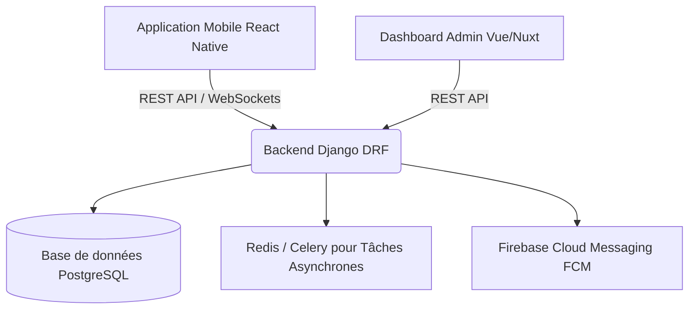

# Architecture Globale - Zemy

## Vue d'ensemble
Le projet Zemy est une plateforme de covoiturage et de livraison de colis.
Il repose sur une architecture moderne en 3 tiers.

```mermaid
graph TD
    A[Application Mobile React Native] -->|REST API / WebSockets| B(Backend Django DRF)
    C[Dashboard Admin Vue/Nuxt] -->|REST API| B
    B --> D[(Base de données PostgreSQL)]
    B --> E[Redis / Celery pour Tâches Asynchrones]
    B --> F[Firebase Cloud Messaging FCM]
```
