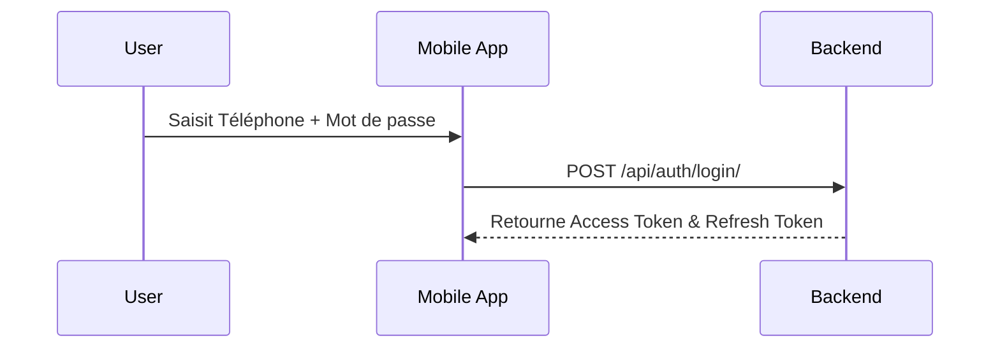

# Authentification - Zemy

L'authentification utilise des tokens JWT via `djangorestframework-simplejwt`.

```mermaid
sequenceDiagram
    User->>Mobile App: Saisit Téléphone + Mot de passe
    Mobile App->>Backend: POST /api/auth/login/
    Backend-->>Mobile App: Retourne Access Token & Refresh Token
```
