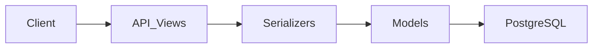

# Architecture Backend - Zemy

Le backend utilise Django et Django REST Framework.

```mermaid
graph LR
    Client --> API_Views
    API_Views --> Serializers
    Serializers --> Models
    Models --> PostgreSQL
```
